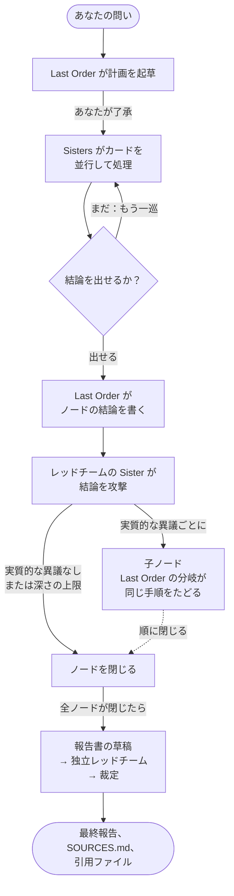

<h1 align="center">
  <br>
  MISAKA
</h1>

<p align="center"><strong>人文・社会科学のための、AI エージェントの研究チーム。</strong></p>

<p align="center"><em>すべての結論はレッドチームの検証を受け、根拠の資料はそのすぐ隣に置かれます、とミサカは報告します。</em></p>

<p align="center"><a href="README.md">English</a> · <a href="README.zh-CN.md">简体中文</a> · 日本語</p>

MISAKA の登場人物は『とある魔術の禁書目録』から借りています（[名前の由来](#名前の由来)）。**Last Order**（打ち止め）はあなたが話しかける取りまとめ役、**Sisters**（妹達）は彼女が送り出す専門家たちです。歴史学者、計量経済学者、批判役など、誰にするかはあなたが決めます。一人ひとりが検体番号と、自分のスキルやツール、そして自分のモデルを持っています。ミサカネットワークと同じく、彼女たちは学んだことを共有します。同じプロジェクトのエージェントなら、誰でも他のエージェントの会話を検索できます。

問いを渡すと、Last Order はまずあなたと一緒に研究計画を立てます。Sisters が並行して調査し、出てきた結論をレッドチームが攻撃します。実質的な異議はひとつひとつが新しい研究の枝になり、その枝にもチームとレッドチームがつきます。すべての枝が閉じると、Last Order が報告書を起草し、独立したレッドチームがそれを審査し、彼女が異議の一つひとつに裁定を下します。最終報告は、引用したファイルそのものと並べて、あなたのプロジェクトフォルダに保存されます。

<p align="center">
  
</p>

## ほかと何が違うのか

- **チームは自分で編成。** Sister にはそれぞれ専門分野（Last Order はこれを見て仕事を振ります）、自分のスキルと MCP サーバー、自分のモデルがあります。一人は Claude、もう一人は GPT という編成もできます。
- **自分の結論に反論する研究。** 結論を攻撃するのにいちばん向いた Sister が審査し、実質的な異議が出れば、そのたびに子ノードが開いて同じ手順を最初からたどります。深さはあなたが決めます。
- **主張を種類ごとに区別。** 事実・推論・解釈・価値判断は、それぞれそうと明示して申告されます。証拠で決着がつかないときは、対立する結論を並べたまま残します。多数決では決めません。
- **ファイルまでたどれる。** 各ノードのフォルダには計画、各 Sister の成果、結論、レッドチームの批評があり、`SOURCES.md` と、引用したすべてのファイルへのハードリンクが付きます。
- **主導権はあなたに。** 計画はあなたの了承を待ちます。了承といっても、ふつうに会話するだけです。どの枝とも専用のタブで直接話せ、不要な枝は外せ、研究は止めて後から再開できます。
- **手元の資料とウェブ。** PDF、EPUB、DjVu、Office ファイル、メモを索引化できます。エージェントは目次やページ単位で読み、ページ画像を確認し、引用が何ページにあるかを突き止めます。ウェブ検索はキーなしでも使えます。
- **途切れない記憶。** 長い会話は切り捨てられずに圧縮され、履歴はすべて検索できます。

## 研究の進み方

> *計画ができたよ！あなたが「いいよ」って言ったらすぐ始めるから！ってミサカはミサカは計画書を両手で差し出してみたり。*



1. **計画。** Last Order は、問いが本当は何を問うているのかを見きわめ、各部分を専門の合う Sister に割り当て、レッドチーム役の Sister を指名します。計画はあなたの了承を待ちます。彼女と相談し、あなたが同意したら始まります。
2. **カード。** 割り当てはそれぞれカードになります。Sisters は自分のセッションでカードを並行して進め、見つけたことを出典とともに申告していきます。
3. **追加の巡回。** 結果に穴があれば、Last Order は結論を出す前にもう一度 Sisters を送り出します（既定では追加は二巡まで。増やすこともできます）。
4. **レッドチーム。** Last Order がノードの結論を書き、レッドチームの Sister が、計画と証拠と Last Order 自身の推論を手元に置いて、それを攻撃します。
5. **枝分かれ。** 実質的な異議はそれぞれ子ノードになります。子ノードは Last Order の会話を分岐させたもので、自分の Sisters とレッドチームを連れて同じ手順をたどります。研究の木は一段ずつ、あなたが選んだ深さまで育ちます（選ばなければ問いから三段下まで）。
6. **最終報告。** すべてのノードが閉じると、Last Order が報告書を起草し、独立したレッドチームが草稿を審査し、彼女が各異議を受け入れるか、退けるか、未決のまま残すかを、理由とともに最終報告に書き込みます。

研究は進むそばから保存され、`/research resume` で止まったところから再開できます。自動実行、深さと並列数、枝の除外、シェルからの実行については[研究ガイド](docs/guide/research.md)（英語）を参照してください。

## 得られるもの

> *引用した資料は、すべて確かめられる場所に綴じてあります、とミサカは報告します。*

成果物はすべてプロジェクトフォルダに、ノードごとに一つのフォルダとして書き出されます。

```
your-project/
├── PROJECT.md                  Last Order が更新し続けるプロジェクト概要
├── nodes/<node>/
│   ├── plan.md                 計画と、その Sisters を選んだ理由
│   ├── cards/<card>/           各 Sister の成果と、レッドチームの critique.md
│   ├── synthesis.md            ノードの結論
│   ├── deliberation.md         レッドチームに渡した Last Order の推論
│   ├── SOURCES.md              結論が引用したすべてのファイル……
│   └── sources/                ……のハードリンク
└── final/<run>-final.md        裁定済みの最終報告（問い・概観・草稿も同じ場所に）
```

`SOURCES.md` には、引用されたファイルごとに、チェックサム、どこで引用されたか、Sisters が申告したどの発見がそれに依拠しているかが記録されます。

```markdown
- `sources/t_3f8cc0/notes.md` ← `nodes/b_ebf11de142/cards/t_3f8cc0/notes.md`
  - sha256 46559fecec176cae…
  - cited in `nodes/b_ebf11de142/synthesis.md`
  - cited by [t_3f8cc0] "…" (inference)
```

ハードリンクなので余分な容量は使わず、元のファイルも動きません。プロジェクトが git リポジトリなら（`misaka init` でそうなります）、ノードが閉じるたびと研究の完了時にコミットされます。

## インストール

Python 3.12 以上、git、[ripgrep](https://github.com/BurntSushi/ripgrep)、[fd](https://github.com/sharkdp/fd) が必要です。macOS と Linux で動きます。

```sh
uv tool install "misaka[providers] @ git+https://github.com/Luciole-Studio/Misaka-Agent.git"
```

`pip install` や `pipx install` でも同じ指定が使えます。`providers` はすべてのモデル SDK を入れます。使うプロバイダが一つだけなら、その extra を指定してください（`anthropic`、`openai`、`google`、`bedrock`、`mistral`。OpenRouter など OpenAI 互換のエンドポイントは `openai`）。`pageindex` は長い PDF の目次抽出、`browser` はブラウザ操作ツールを追加します。インストールはこのリポジトリから行ってください。PyPI の `misaka` は無関係のパッケージです。

## クイックスタート

> *最初の問いがコインです。弾いてください。* ⚡

```sh
mkdir my-research && cd my-research
misaka setup     # ログイン、モデル選択、最初の Sisters の作成、このフォルダのプロジェクト化
misaka           # パネルを開いて /research と入力
```

<p align="center">
  
</p>

手元に PDF や EPUB、メモがあるなら、setup の前にこのフォルダ（たとえば `sources/`）に入れておけば setup が索引を作ります。あとから `misaka doc scan sources/` でも構いません。`/research` とだけ入力すると、どこまで深く調べるか、同時にどれだけ動かすか、ノードごとに何巡まで追加するか、計画をあなたの了承待ちにするかを順に尋ね、次のメッセージを問いとして受け取ります。シェルから始めるなら `misaka research "問い"` です。

## チーム

> *検体番号10032号、着任しました、とミサカは敬礼します。*

Last Order は MISAKA に最初から入っています。Sisters はあなたが作ります。一人がもう一人のレッドチームを務められるので、二人いれば始められます。

```sh
misaka create 10032 --desc "歴史・社会研究：公文書、新聞雑誌、オーラルヒストリー"
misaka create 10043 --desc "独立審査：異論、再現、皆が見落としたもの"
```

Sister は一人につき `~/.misaka/profiles/sisters/<id>/` のフォルダ一つです。

| ファイル | 中身 |
|---|---|
| `DESCRIBE.md` | 専門分野。Last Order はこれを読んで何を任せるか決めます |
| `SOUL.md` | 性格と話し方 |
| `settings.json` | 自分のモデルと MCP サーバー |
| `skills/` | 彼女だけが使うスキル |

実際に使っている編成の例：

| Sister | 専門 |
|---|---|
| 10032 | 歴史・社会研究 |
| 10036 | 実証計量と因果識別 |
| 10037 | マクロ経済と公共政策 |
| 10043 | 独立審査と再現 |

全エージェント共通の設定、プロンプトの組み立て方、特定の Sister と直接話す方法は[チームガイド](docs/guide/team.md)（英語）にあります。

## よく使うコマンド

| やりたいこと | コマンド |
|---|---|
| パネルを開く（パイプ経由ならふつうのチャット） | `misaka` |
| 一人の Sister と話す | チャットで `/sister 10032`、または `misaka chat --as 10032` |
| 研究を始める | チャットで `/research`、または `misaka research "問い"` |
| 研究の確認・停止・再開 | `/research status`、`/research stop`、`/research resume` |
| タスクボードを見る | `/board` または `misaka board` |
| Sister の追加・削除 | `misaka create ID`、`misaka remove ID` |
| 文書の索引化 | `misaka doc add ファイル`、`misaka doc scan フォルダ` |
| モデル選択・ログイン | `/model`、`/login` |
| ウェブ検索の設定 | `misaka web` |
| スキルの管理 | `misaka skills` |
| 不具合の報告 | `/debug` で画面と会話全体をログに書き出し、そのパスを表示 |
| 更新・アンインストール | `misaka update --apply`、`misaka uninstall` |

そのほかは `misaka --help` で確認できます。

## モデル

`/login` でブラウザからサインインするか（Anthropic、OpenAI の ChatGPT プラン、GitHub Copilot、xAI、OpenRouter）、カタログにある任意のプロバイダの認証情報を設定します。Google、Mistral、Bedrock も含まれます。ローカルのモデルサーバーや OpenAI 互換のゲートウェイは `~/.misaka/models.json` に書きます。`/model` は全エージェントの既定モデルを決め、Sister ごとに自分のモデルを固定することもできます。

## データと費用

MISAKA が保存するものはすべてあなたのマシンの中にあります。設定、認証情報、セッション、タスクボードは `~/.misaka/` に、研究の成果物はプロジェクトフォルダに置かれます。プロンプトはあなたが設定したモデルプロバイダにだけ送られます。検索は設定した検索サービスに送られ、何も設定していないときや設定したサービスが失敗したときは Exa、Parallel、Firecrawl、Keenable の無料公開枠を順番に使います（`misaka web set keyless_fallback false` で止められます）。MISAKA 自身はテレメトリを一切送らず、更新の確認も `misaka update` か `misaka setup` を実行したときだけです。あとから追加したスキルや MCP サーバーは、独自にネットワークへ接続することがあります。`misaka uninstall` は `~/.misaka` を削除しますが、プロジェクトフォルダには触れません。

研究は大きく広がります。既定では最大四つのノードが同時に動き、各ノードで最大四枚の Sister のカードが並行します。全体の上限はマシンのメモリ量で決まります。深い研究ではモデルの呼び出しが大量に並行するので、`~/.misaka/settings.json` の `research.token_cap` でトークン予算を設定しておくと、タスクボードがそれを守らせます。

## ドキュメント

| やりたいこと | 読むもの |
|---|---|
| 研究を動かす：了承、深さ、並列数、再開、シェルからの実行 | [docs/guide/research.md](docs/guide/research.md) |
| チームを作る：役割、プロフィール、プロンプト、モデル、スキル | [docs/guide/team.md](docs/guide/team.md) |
| 文書とウェブを使う | [docs/guide/sources.md](docs/guide/sources.md) |
| 設定を変える | [CONFIGURATION.md](CONFIGURATION.md) |
| 各部分の出どころを知る | [THIRD_PARTY_NOTICES.md](THIRD_PARTY_NOTICES.md) |

いずれも現在は英語のみです。

## 名前の由来

MISAKA の名前は、鎌池和馬『とある魔術の禁書目録』『とある科学の超電磁砲』から借りています。原作では、妹達（シスターズ）は「超電磁砲」御坂美琴のクローンで、ミサカネットワークを通じて記憶を共有しています。

| 原作 | MISAKA |
|---|---|
| **御坂美琴**、すべての妹達のオリジナル | `MISAKA.md`：どのエージェントも自分の設定より先に読み込む、共通の人格 |
| **妹達（シスターズ）**、検体番号で呼ばれる：ミサカ10032号、10033号…… | あなたの専門家たち。それぞれ番号と専門分野と自分の `SOUL.md` を持ちます |
| **打ち止め（ラストオーダー）**、ミサカ20001号、ネットワークの上位個体 | あなたが話しかける取りまとめ役 |
| **ミサカネットワーク**、一人が学んだことを他の妹達も思い出せる | プロジェクトの共有記憶。どのエージェントも検索できます |

この README の「とミサカは報告します」は演出です。エージェントの話し方は、それぞれの `SOUL.md` しだいです。妹達のように話してほしければ、`SOUL.md` に一行書き足すだけです。

MISAKA は独立したプロジェクトで、原作者および出版社とは一切関係がなく、公認も受けていません。

## 土台

MISAKA のエージェントカーネルは [pi](https://github.com/earendil-works/pi) の Python 移植で、パネルは [herdr](https://github.com/herdrdev/herdr) の移植です。各ペインの裏では [ghostty](https://github.com/ghostty-org/ghostty) の端末ライブラリが動いています。長い会話の管理は [hermes-lcm](https://github.com/stephenschoettler/hermes-lcm)、文書構造の抽出は [PageIndex](https://github.com/VectifyAI/PageIndex) を土台にし、ウェブツールとスキルは [Hermes Agent](https://github.com/NousResearch/hermes-agent) から、Office 対応は [FrontierAgent](https://github.com/ApodexAI/FrontierAgent) から移植しています。どこから何を取り込み、どのコミットを基準に何を変えたかは [THIRD_PARTY_NOTICES.md](THIRD_PARTY_NOTICES.md) に記録しています。

## ライセンス

[Apache License 2.0](LICENSE)。サードパーティのコンポーネントはそれぞれのライセンスに従い、すべて THIRD_PARTY_NOTICES.md に記録しています。

<p align="center"><em>以上、ミサカネットワークより通信を終わります、ってミサカはミサカは締めくくってみたり。</em></p>
