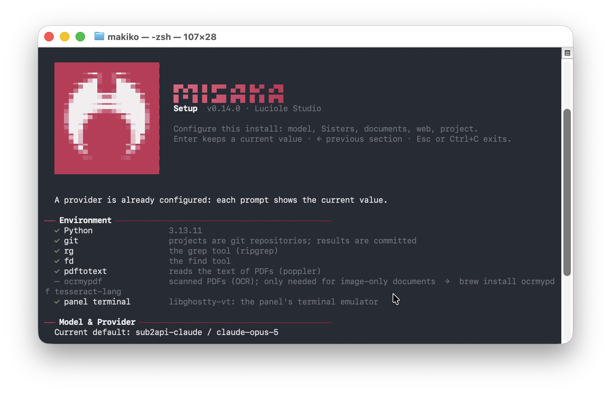
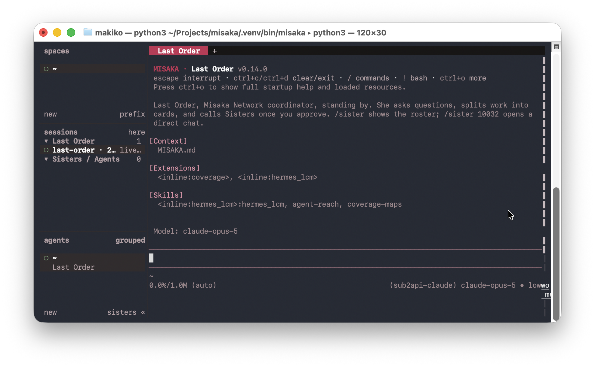

<h1 align="center">
  <br>
  MISAKA
</h1>

<p align="center"><strong>人文・社会科学のためのマルチエージェント研究システム。</strong></p>

<p align="center"><a href="README.md">English</a> · <a href="README.zh-CN.md">简体中文</a> · 日本語</p>

調べたい問いを渡すと、MISAKA はそれを課題に分解し、エージェントのチームを並列で走らせ、
出てきた結論をレッドチームに攻撃させたうえで、成果をプロジェクトフォルダに書き出します。
根拠となった資料は、その隣に並べて置かれます。

結論が反証に耐えなければならない仕事のために作られています。どの結論にも `SOURCES.md` と、
実際に引用したファイルそのものを収めたフォルダが必ず付きます。

```sh
misaka init                              # このフォルダをプロジェクトにする
misaka doc add sources/                  # 手元の PDF をインデックスする
misaka research "日本の公共図書館運動は1920年から1950年にかけてどう変わったか"
```

最後のコマンドが開くのはプログレスバーではなく、一つの対話です。理由は以下に書きます。

<p align="center">
  
</p>

## 実行の流れ

作業を担うのは二つの役割です。

| 役割 | 担当 |
|---|---|
| **Last Order** | 調整役。問いを計画に、計画をタスクカードに変え、最後に結論を書く。 |
| **Sisters** | 実行役。カードを一枚ずつ受け取り、各自のプロセスで自分の道具を使って片付ける。 |

一回の実行は五段階で進みます。

1. **計画を立てる。** Last Order が進め方を起草し、あなたに見せます。
2. **あなたの承諾を待つ。** 計画はここで止まります。普通の会話として話し合い、彼女は
   あなたの意見を受けて書き直し、納得がいくまで続けます。承認コマンドも合言葉もありません。
   あなたが納得したと判断した時点で、彼女自身が開始を記録します。無人で走らせるときは
   `MISAKA_RESEARCH_PLAN_APPROVAL=0` を指定します。コマンドラインの `misaka research` は
   ルートに会話がないため、全体が無人実行になります。
3. **カードを配る。** 計画がタスクカードになり、Sisters が受け取って並列で作業します。
   同時実行数は上限に従います。各 Sister はまず自分のやり方を普通の散文で簡潔に述べ、
   そのまま同じセッションの中で作業を完了します。別立ての計画ファイルや、記入すべき
   JSON の受け渡し書式はありません。
4. **必要なら次のラウンドへ。** Last Order は結論を書かずに、もう一度 Sisters を送り出す
   こともできます。`--followups N` は最初のカードが戻ってきた後に追加できる回数の上限で、
   既定値は 2 です。計画についてあなたと話し合った分は、この回数に数えません。どのラウンドの
   計画も、最初と同じようにあなたの承諾を待ちます。
5. **結論とレッドチーム。** 結論は全ラウンドを踏まえて書かれ、その後レッドチームが
   それを攻撃します。実質的な問題が見つからなかった場合、または深度上限に達した場合は、
   モデルを一度も呼ばずに記録だけが残ります。

深追いしたくない枝は、あなたの判断で飛ばせます。そのノードは未調査のまま閉じ、理由は
記録に残って最終判断のときに考慮されます。

## 成果物の置かれ方

成果は選んだプロジェクトの中に、ノードごとに一つのフォルダとして書き出されます。

```
your-project/
├── nodes/<node>/              計画・結論・レビュー
│   ├── cards/<card>/          各 Sister の成果
│   ├── SOURCES.md             結論が依拠している資料
│   └── sources/               引用されたファイルそのもの
└── final/<run>-<file>         問い・サーベイ・草稿・最終報告
```

`sources/` の中身はハードリンクなので容量を食わず、原本が動くこともありません。リンクを
張れない場合にだけコピーになります。これらは派生物であり、登録もインデックスもコミットも
されません。

Git の履歴は任意で、しかも軽量です。ノードが閉じるたびに一つ、実行の終わりに一つ。
納品に worktree もマージも要りません。

## インストール

MISAKA は PyPI にはありません。あちらの `misaka` は無関係なパッケージです。本リポジトリから
インストールしてください。

```sh
# 実際に使うプロバイダの SDK を選ぶ
pip install "misaka[anthropic] @ git+https://github.com/Luciole-Studio/Misaka-Agent.git"

# チェックアウトから入れる場合
git clone https://github.com/Luciole-Studio/Misaka-Agent.git
cd Misaka-Agent && pip install ".[anthropic]"

# 開発環境
uv venv .venv --python 3.13 && uv sync
```

追加コンポーネント: `anthropic`、`openai`、`google`、`bedrock`、`mistral`、または
五つまとめて入れる `providers`。`pageindex` は PDF の目次抽出を、`browser` はブラウザ
ツールを追加します。

MISAKA が代わりに入れてくれないものが二つあります。

- **git** は必須です。`misaka init` がプロジェクトのリポジトリを作り、採用された結果は
  そこにコミットされます。`xcode-select --install` または `apt install git` で先に入れてください。
- **ripgrep** と **fd** は `grep` と `find` ツールの実体です。`brew install ripgrep fd`
  か `apt install ripgrep fd-find` で入れるか、バイナリを `~/.misaka/agent/bin` に
  置いてください。

## 最初の一回

```sh
misaka setup
```

ウィザードが環境を確認し、プロバイダの認証情報と既定モデルを保存してテストリクエストを
一度送り、最初の Sisters を作り、PDF の追加コンポーネントを勧め、キーがあれば Web 検索の
バックエンドを固定し、プロジェクトフォルダを初期化します。各節は単独で再実行できます
（たとえば `misaka setup model`）。認証情報が未設定のまま `misaka` を実行すると、
ウィザードが自分から立ち上がります。

`misaka update` はこのインストールがリポジトリの `main` より遅れていないかを報告し、
`--apply` で早送りします。リリースタグではなくブランチを追い、早送りできない
チェックアウトは解決せずに理由を出して止まります。

その反対側が `misaka uninstall` です。`~/.misaka` の下に何がどれだけ入っているかを先に
示したうえで、認証情報・ボード・コンテキストエンジンの記憶・各種キャッシュをまとめて
削除します。プロジェクトフォルダには一切触れず、触れないことを示すために一覧を出します。
パッケージ自体の削除はインストーラの仕事なので、そのコマンドを表示するだけにとどめます。

入れたばかりの状態では `anthropic` / `claude-sonnet-4-5` に接続します。認証情報を手で
渡す場合:

```sh
export ANTHROPIC_API_KEY=sk-ant-...   # 組み込みプロバイダはすべて環境変数を尊重します
misaka auth check                     # プロバイダごとに、セッションと同じ解決経路で確認
```

チャットの中では `/login` が OAuth トークンか API キーを `~/.misaka/agent/auth.json` に
パーミッション 0600 で保存します。`/model` はモデル選択画面を開き、そこで選ぶとすべての
Sister の既定値として保存されます。`/model <名前>` は目の前のセッションだけを切り替えます。

## コマンド

```sh
misaka                 # パネル。パイプに繋がれたときは素のチャット
misaka chat            # Last Order と話す
misaka research "..."  # 研究を一回走らせる
misaka board           # タスクボード
misaka doc add x.pdf   # 文書をインデックスする
misaka create          # Sister を追加する
misaka web status      # 現在の検索バックエンドと認証情報
```

残りは `misaka --help` にあります: `task`、`tell`、`dm`、`net`、`skills`、`bundles`、
`moa`、`lcm`、`auth`、`remove`、`uninstall`、`update`。

## パネル

<p align="center">
  
</p>

端末で `misaka` をそのまま実行すると、複数ペインのパネルが開きます。fork した研究の枝は
自分のタブを持ちます。ノードのプロセスがそこで Last Order を対話ウィンドウとして走らせ、
彼女の Sisters が隣にグリッドで並びます。そのタブで入力した内容は、その Last Order 自身の
一ターンになります。ノードが閉じてもウィンドウは残るので、何を見つけたのか聞き続けられます。
実行中に閉じるとノードは終了し、`/research resume` でやり直せます。

コマンドラインでの実行にはパネルがないため、ノードはバックグラウンドプロセスになります。
`misaka chat --attach --session PATH` で接続すると、入力は本来の持ち主に直接届き、間に
別のモデルは入りません。Enter は動作中のセッションに指示を足し、待機中のセッションでは
一ターンを開始します。`/pause` は次のリクエスト・ツール・ワークフローの境界で保留し、
`/resume` が解放します。すでに走っているツールやエージェントは止まりません。接続した
ウィンドウを閉じても、切断されるだけです。

## 文書と Web

`doc_add`、`doc_find`、`doc_read`、`doc_outline`、`doc_page_image`、`doc_verify` により、
エージェントは引用でき、引用元と突き合わせて検証できるコーパスを持ちます。`misaka doc` は
同じものへのシェルからの入口です。

Web 検索は設定ゼロで動きます。キー不要のベンダーリングが担います。バックエンドを固定したり
キーを足したりするには:

```sh
misaka web set backend tavily
misaka web set env.TAVILY_API_KEY tvly-...   # ~/.misaka/web.json に 0600 で書かれます
```

エクスポートされた環境変数は常にファイルより優先されます。`misaka web setup` にはプロバイダと
ティアの選択画面があり、認証情報の入力は伏字になります。探索・有効化と無効化・再読み込み・
現在の上限は `misaka web --help` を参照してください。

エージェントは通常の作業道具も持ちます: `bash`、`read`、`write`、`edit`、`grep`、`find`、
`web_fetch`、`download_file`、そして `.docx` / `.xlsx` / `.pptx` を読み書きする `office`。

## コンテキストエンジン

長いセッションは **MISAKA LCM** を使用します。固定版
[hermes-lcm](https://github.com/stephenschoettler/hermes-lcm) のプロジェクト単位の fork です。
圧縮・検索アルゴリズムは維持し、キャッシュを `<project>/.misaka/lcm/` に分離します。
同じプロジェクトのエージェントは共有し、最後の利用プロセスの終了時に削除します。
異常終了で残ったキャッシュは次の起動時に清掃します。

セッション原文とチェックポイントは保存され、再開時に LCM を再構築します。
引き継ぎ元のセッションも保持してください。履歴、Board、成果物は削除対象ではありません。

LCM に設定された秘匿化・除外・保持・GC の各ポリシーはそのまま効きます。生データが無条件に
永久保持されると約束するものではありません。アルゴリズム設定は上流の `LCM_*` の名前をその
まま使い、製品独自の別名は設けていません。`misaka lcm --help` が上流本来の操作文法を
公開します。ソースを移植したことは、上流ホストの挙動がすべて再現されていることの保証では
ありません。差分は `misaka/extensions/misaka_lcm/PORT_NOTES.md` に記録しています。

## 設定

すべて `~/.misaka/` の下にあり、環境変数がファイルより優先されます。

| 場所 | 内容 |
|---|---|
| `agent/settings.json` | エンジン設定。`defaultProvider` と `defaultModel` を含む |
| `agent/auth.json` | 保存された認証情報、パーミッション 0600 |
| `agent/models.json` | 独自プロバイダとモデル。OpenAI 互換ゲートウェイなど |
| `profiles/last_order/` | Last Order の人格・スキル・MCP 設定 |
| `profiles/sisters/<id>/` | Sister ごとに一つのディレクトリ |

よく使うものだけ挙げると:

| 変数 | 既定値 | 意味 |
|---|---|---|
| `MISAKA_PROVIDER` / `MISAKA_MODEL` | `anthropic` / `claude-sonnet-4-5` | Sisters とチャットのプロバイダとモデル |
| `MISAKA_MAX_CONCURRENT_SISTERS` | 空きメモリ / 256 MiB、4〜12 | このホストで同時に走るカード数 |
| `MISAKA_TOKEN_CAP` | `0`、無効 | ボードに表示され強制される token 予算 |
| `MISAKA_RESEARCH_PLAN_APPROVAL` | `1`、有効 | 計画があなたの承諾を待つかどうか |
| `MISAKA_THEME` | 端末に従う | `dark` または `light` |

**七十ほどある変数の全体は [CONFIGURATION.md](CONFIGURATION.md) にあります。**
制御する対象ごとにまとめてあります。数値として解釈できない値が来るとコマンドは停止し、
変数名とその値を示します。これらの表にない `MISAKA_*` は、MISAKA が自分の子プロセス用に
設定しているものです。

## 診断

チャット内の `/debug` は、描画された画面と会話全体を `~/.misaka/agent/misaka-debug.log`
にパーミッション 0600 で書き出し、そのパスを表示します。診断スイッチはこれだけで、
デバッグ用の環境変数は存在しません。

## 土台

MISAKA のカーネルは [pi](https://github.com/earendil-works/pi) の Python への移植で、
パネルは [herdr](https://github.com/herdrdev/herdr) の移植です。コンテキスト管理に
[hermes-lcm](https://github.com/stephenschoettler/hermes-lcm)、PDF の構造抽出に
[PageIndex](https://github.com/VectifyAI/PageIndex)、各ペインの裏側の端末エミュレータに
[ghostty](https://github.com/ghostty-org/ghostty) の VT ライブラリを収録しています。

何がどこから来て、どのコミットに固定され、何を変えたかの全索引は
[THIRD_PARTY_NOTICES.md](THIRD_PARTY_NOTICES.md) にあります。

## ライセンス

[Apache License 2.0](LICENSE)。第三者コンポーネントはそれぞれのライセンスを保持しており、
すべて THIRD_PARTY_NOTICES.md に記録されています。
