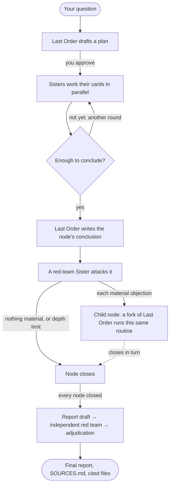

<h1 align="center">
  <br>
  MISAKA
</h1>

<p align="center"><strong>A research team of AI agents for the humanities and social sciences.</strong></p>

<p align="center"><em>Every conclusion faces a red team and keeps its sources beside it, says Misaka.</em></p>

<p align="center">English · <a href="README.zh-CN.md">简体中文</a> · <a href="README.ja.md">日本語</a></p>

MISAKA borrows its cast from *A Certain Magical Index* ([about the name](#about-the-name)).
**Last Order** is the coordinator you talk to. The **Sisters** are the specialists she sends
out: a historian, an econometrician, a critic, whoever you define. Each has a serial number,
her own skills and tools, and her own model. Like the Misaka Network, they share what they
learn: any agent in a project can search the others' conversations.

Ask a question and Last Order plans the research with you. The Sisters work on it in
parallel, then a red team attacks the conclusion. Each serious objection becomes a new branch
of research, with its own team and its own red team. When every branch has closed, Last Order
drafts the report, an independent red team reviews it, and she rules on each objection. The
report lands in your project folder next to the exact files it cites.

<p align="center">
  
</p>

## What makes it different

- **A team you design.** Each Sister has a specialty that Last Order assigns work by, her own
  skills and MCP servers, and her own model: one can run on Claude, another on GPT.
- **Research that argues back.** The Sister best placed to attack a conclusion reviews it, and
  each material objection opens a child node that repeats the whole routine, down to a depth you
  choose.
- **Claims kept apart.** Facts, inferences, interpretations and value judgements are declared as
  such. When the evidence can't decide, rival conclusions stay side by side; nothing is settled
  by vote.
- **Traceable to the file.** Each node's folder holds the plan, every Sister's work, the
  conclusion and the critique, with a `SOURCES.md` and hard links to every file cited.
- **You stay in charge.** A plan waits for your go-ahead in plain conversation. Talk to any branch
  in its own tab, drop the branches you don't need, stop a run and resume it later.
- **Your library and the web.** Index PDFs, EPUBs, DjVu, Office files and notes. Agents read by
  outline or by page, look at page images and find the page a quotation is on. Web search works
  without a key.
- **Memory that lasts.** Long conversations are compacted, not cut off, and the full history
  stays searchable.

## How a research run works

> *The plan's ready! Misaka Misaka starts the moment you say so, says Misaka Misaka, holding it out with both hands.*



1. **Plan.** Last Order works out what the question is really asking, gives each part to the
   Sister whose specialty fits, and names a red-team Sister. The plan waits for your go-ahead:
   talk it over with her, and she starts once you agree.
2. **Cards.** Each assignment becomes a card. The Sisters work their cards in parallel, each in
   her own session, and declare their findings with sources as they go.
3. **More rounds.** If the results leave gaps, Last Order sends Sisters out again before she
   concludes (two extra rounds at most, unless you allow more).
4. **Red team.** Last Order writes the node's conclusion, and the red-team Sister attacks it
   with the plan, the evidence and Last Order's own reasoning in hand.
5. **Branches.** Each material objection becomes a child node: a fork of Last Order's
   conversation that runs this same routine with its own Sisters and red team. The tree grows
   one level at a time, to the depth you choose (three levels below your question if you don't).
6. **Final report.** Once every node has closed, Last Order drafts the report, an independent
   red team reviews the draft, and she accepts, rejects or leaves open each objection, with her
   reasons, in the final report.

A run is saved as it goes, and `/research resume` carries on from wherever it stopped. The
[research guide](docs/guide/research.md) covers automatic runs, depth and parallelism, dropping
a branch, and running from the shell.

## What you get

> *Every source is filed where you can check it, Misaka reports.*

Everything is written into your project folder, one folder per node:

```
your-project/
├── PROJECT.md                  the brief Last Order keeps current
├── nodes/<node>/
│   ├── plan.md                 what she planned, and why these Sisters
│   ├── cards/<card>/           each Sister's work, and the red team's critique.md
│   ├── synthesis.md            the node's conclusion
│   ├── deliberation.md         Last Order's reasoning, as the red team saw it
│   ├── SOURCES.md              every file the conclusion cites…
│   └── sources/                …hard-linked here
└── final/<run>-final.md        the adjudicated report, beside the question, survey and draft
```

For each cited file, `SOURCES.md` records its checksum, where it is cited, and which of the
Sisters' declared findings rest on it:

```markdown
- `sources/t_3f8cc0/notes.md` ← `nodes/b_ebf11de142/cards/t_3f8cc0/notes.md`
  - sha256 46559fecec176cae…
  - cited in `nodes/b_ebf11de142/synthesis.md`
  - cited by [t_3f8cc0] "…" (inference)
```

Hard links take no extra space, and the originals never move. If the project is a git
repository (`misaka init` makes it one), each closed node and the finished run are committed.

## Install

You need Python 3.12 or newer, git, [ripgrep](https://github.com/BurntSushi/ripgrep) and
[fd](https://github.com/sharkdp/fd), on macOS or Linux.

```sh
uv tool install "misaka[providers] @ git+https://github.com/Luciole-Studio/Misaka-Agent.git"
```

`pip install` and `pipx install` take the same requirement. `providers` brings every model
SDK; if you only use one, name its extra instead (`anthropic`, `openai`, `google`, `bedrock` or
`mistral`; OpenRouter and other OpenAI-compatible endpoints use `openai`). `pageindex` adds
outlines for long PDFs, and `browser` the browser tools. Install from this repository: the
`misaka` package on PyPI is an unrelated project.

## Quick start

> *Your first question is the coin. Flip it.* ⚡

```sh
mkdir my-research && cd my-research
misaka setup     # sign in, pick a model, create your first Sisters, make this folder a project
misaka           # open the panel, then type /research
```

<p align="center">
  
</p>

Have PDFs, EPUBs or notes already? Put them in the folder (say, in `sources/`) before running
setup and it will index them, or run `misaka doc scan sources/` later. Bare `/research` asks
how deep to go, how much to run at once, how many extra rounds a node may take and whether
plans wait for you; your next message is the question. `misaka research "QUESTION"` starts a
run from the shell instead.

## Your team

> *Misaka 10032, reporting for duty, says Misaka.*

Last Order comes with MISAKA; the Sisters are yours to create. Two are enough to start, since
one can red-team the other:

```sh
misaka create 10032 --desc "History and social research: archives, periodicals, oral history"
misaka create 10043 --desc "Independent review: dissent, replication, what everyone else missed"
```

Each Sister is a folder under `~/.misaka/profiles/sisters/<id>/`:

| File | What it holds |
|---|---|
| `DESCRIBE.md` | her specialty; Last Order reads it to decide what to send her |
| `SOUL.md` | her personality and voice |
| `settings.json` | her own model and MCP servers |
| `skills/` | skills only she sees |

A roster from real use, for example:

| Sister | Specialty |
|---|---|
| 10032 | History and social research |
| 10036 | Econometrics and causal identification |
| 10037 | Macroeconomics and public policy |
| 10043 | Independent review and replication |

What every agent shares, how a prompt is put together, and how to talk to one Sister directly
are in the [team guide](docs/guide/team.md).

## Everyday commands

| To | Run |
|---|---|
| open the panel (plain chat when piped) | `misaka` |
| talk to one Sister | `/sister 10032` in chat, or `misaka chat --as 10032` |
| start a research run | `/research` in chat, or `misaka research "QUESTION"` |
| check, stop or resume a run | `/research status`, `/research stop`, `/research resume` |
| see the task board | `/board`, or `misaka board` |
| add or remove a Sister | `misaka create ID`, `misaka remove ID` |
| index documents | `misaka doc add FILE`, `misaka doc scan FOLDER` |
| pick a model, sign in | `/model`, `/login` |
| set up web search | `misaka web` |
| manage skills | `misaka skills` |
| report a problem | `/debug` writes the screen and the conversation to a log and prints its path |
| update, uninstall | `misaka update --apply`, `misaka uninstall` |

`misaka --help` lists the rest.

## Models

Sign in through the browser with `/login` (Anthropic, OpenAI's ChatGPT plans, GitHub Copilot,
xAI, OpenRouter), or give the credentials of any provider in the catalog, Google, Mistral and
Bedrock included. A local server or any OpenAI-compatible gateway goes in
`~/.misaka/models.json`. `/model` sets the default for every agent; a Sister can pin her own.

## Your data and your bill

Everything MISAKA keeps stays on your machine: settings, credentials, sessions and the board
in `~/.misaka/`, research output in your project folder. Your prompts go to the model providers
you set up. Searches go to the search services you configure; when none is configured, or one
fails, they go to the free public tiers of Exa, Parallel, Firecrawl and Keenable in turn
(`misaka web set keyless_fallback false` turns that off). MISAKA runs no telemetry of its own,
and it checks for updates only when you run `misaka update` or `misaka setup`. Skills and MCP
servers you add may reach the network on their own. `misaka uninstall` removes `~/.misaka` and
never touches a project folder.

A research run fans out. By default up to four nodes run at once, each with up to four Sister
cards, within a limit set by your machine's memory, so a deep run makes many model calls in
parallel. `research.token_cap` in `~/.misaka/settings.json` sets a token budget the board
enforces.

## Documentation

| To | Read |
|---|---|
| run research: approval, depth, parallelism, resuming, shell runs | [docs/guide/research.md](docs/guide/research.md) |
| build the team: roles, profiles, prompts, models, skills | [docs/guide/team.md](docs/guide/team.md) |
| work with documents and the web | [docs/guide/sources.md](docs/guide/sources.md) |
| change a setting | [CONFIGURATION.md](CONFIGURATION.md) |
| see what came from where | [THIRD_PARTY_NOTICES.md](THIRD_PARTY_NOTICES.md) |

## About the name

MISAKA takes its names from Kazuma Kamachi's *A Certain Magical Index* and *A Certain
Scientific Railgun*, in which the Sisters, clones of the Railgun Misaka Mikoto, share their
memories through the Misaka Network.

| In the story | In MISAKA |
|---|---|
| **Misaka Mikoto**, the original every Sister comes from | `MISAKA.md`, the identity every agent loads before her own |
| **The Sisters**, known by serial number: Misaka 10032, 10033, … | your specialists, each with an ID, a specialty and her own `SOUL.md` |
| **Last Order**, Misaka 20001, who commands the network | the coordinator you talk to |
| **The Misaka Network**, where what one Sister learns, the others can recall | a project's shared memory, which every agent can search |

The "says Misaka" lines in this README are flavour; your agents talk however their `SOUL.md`
tells them to. If you want them to talk like the Sisters, one line in `SOUL.md` does it.

MISAKA is an independent project. It is not affiliated with or endorsed by the author or the
publishers of the series.

## Built on

MISAKA's agent kernel is a Python port of [pi](https://github.com/earendil-works/pi), and its
panel is a port of [herdr](https://github.com/herdrdev/herdr), with
[ghostty](https://github.com/ghostty-org/ghostty)'s terminal library behind every pane. It
builds on [hermes-lcm](https://github.com/stephenschoettler/hermes-lcm) for long conversations
and [PageIndex](https://github.com/VectifyAI/PageIndex) for document structure, and ports web
tools and skills from [Hermes Agent](https://github.com/NousResearch/hermes-agent) and Office
support from [FrontierAgent](https://github.com/ApodexAI/FrontierAgent).
[THIRD_PARTY_NOTICES.md](THIRD_PARTY_NOTICES.md) records what came from where, at which commit,
and what was changed.

## Licence

[Apache License 2.0](LICENSE). Third-party components keep their own licences, all recorded in
THIRD_PARTY_NOTICES.md.

<p align="center"><em>Misaka Network, signing off, says Misaka Misaka.</em></p>
