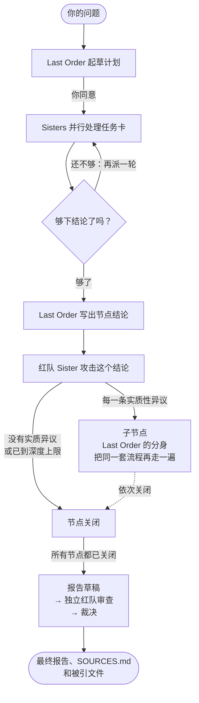

<h1 align="center">
  <br>
  MISAKA
</h1>

<p align="center"><strong>为人文社科研究组建的 AI 研究团队。</strong></p>

<p align="center"><em>每个结论都要过红队，出处就摆在它旁边，御坂如此报告。</em></p>

<p align="center"><a href="README.md">English</a> · 简体中文 · <a href="README.ja.md">日本語</a></p>

MISAKA 的角色取自《魔法禁书目录》（[名字的由来](#名字的由来)）。**Last Order**（最后之作）是你与之对话的协调者；**Sisters**（妹妹们）是她派出去的专家：历史学者、计量经济学者、专挑毛病的批评者，都由你来定义。每位 Sister 有自己的编号、技能、工具和模型。和御坂网络一样，她们共享所学：同一个项目里，任何一个 agent 都能检索其他 agent 的对话。

你提出一个问题，Last Order 先和你一起定下研究计划；Sisters 并行开展研究，红队再来攻击得出的结论。每一条实质性的异议都会长成一个新的研究分支，有自己的团队，也有自己的红队。所有分支收束之后，Last Order 起草报告，由独立红队审查，她再对每一条异议逐一裁决。最终报告写进你的项目文件夹，旁边就是它引用的每一份原文件。

<p align="center">
  
</p>

## 有什么不同

- **团队由你组建。** 每位 Sister 有自己的专长（Last Order 据此分派任务）、自己的技能和 MCP 服务器，还有自己的模型：一位跑 Claude、另一位跑 GPT 也没问题。
- **研究会反驳自己。** 最适合挑刺的那位 Sister 负责审查结论；每一条实质性异议都会开出一个子节点，把整套流程重走一遍，直到你选定的深度。
- **论断分门别类。** 事实、推断、诠释和价值判断各自申明。证据分不出高下时，相互竞争的结论并列保留，不靠投票定案。
- **一路追溯到文件。** 每个节点的文件夹里有计划、每位 Sister 的工作、结论和红队意见，还有一份 `SOURCES.md` 和指向每个被引文件的硬链接。
- **始终由你做主。** 计划要等你点头，而点头就是正常聊天。每个分支都有自己的标签页，可以直接对话；不需要的分支可以跳过；研究可以停下，之后再接着跑。
- **你的资料库与网络。** 可以索引 PDF、EPUB、DjVu、Office 文件和笔记。agent 按目录或页码阅读，能看页面图像，能查到一段引文在第几页。网页搜索不配密钥也能用。
- **记忆不会断。** 长对话会被压缩而不是截断，完整的历史始终可以检索。

## 一次研究怎么进行

> *计划写好啦！只要你点头，御坂御坂马上开工！御坂御坂双手捧着计划书说道。*



1. **计划。** Last Order 先弄清这个问题到底在问什么，把每一部分交给专长对口的 Sister，并指定一位红队 Sister。计划会等你点头：和她商量就行，你同意之后她才开工。
2. **任务卡。** 每项任务变成一张卡。Sisters 各自在自己的会话里并行处理，一边做一边申明发现及其出处。
3. **追加轮次。** 如果结果还有缺口，Last Order 会在下结论之前再派 Sisters 出去（默认最多追加两轮，你可以放宽）。
4. **红队。** Last Order 写出本节点的结论，红队 Sister 拿着计划、证据和 Last Order 自己的推理过程来攻击它。
5. **分支。** 每一条实质性异议都会成为一个子节点：从 Last Order 的对话分叉出来的分身，带着自己的 Sisters 和红队，把同一套流程再走一遍。研究树一层一层展开，直到你选定的深度（不选的话，是问题以下三层）。
6. **最终报告。** 所有节点关闭后，Last Order 起草报告，独立红队审查草稿，她对每一条异议作出接受、驳回或保留分歧的裁决，连同理由一起写进最终报告。

研究过程随时保存，`/research resume` 会从停下的地方接着跑。自动运行、深度与并发、跳过分支、从命令行运行，见[研究指南](docs/guide/research.md)（英文）。

## 你会得到什么

> *引用的每一份材料都已归档，随时可以核查，御坂如此报告。*

所有产出都写进你的项目文件夹，一个节点一个文件夹：

```
your-project/
├── PROJECT.md                  Last Order 随时更新的项目简报
├── nodes/<node>/
│   ├── plan.md                 她的计划，以及为什么选这几位 Sister
│   ├── cards/<card>/           每位 Sister 的工作成果，以及红队的 critique.md
│   ├── synthesis.md            本节点的结论
│   ├── deliberation.md         Last Order 的推理过程（交给红队看的那一份）
│   ├── SOURCES.md              结论引用的每一个文件……
│   └── sources/                ……都硬链接在这里
└── final/<run>-final.md        裁决后的最终报告，旁边是研究问题、综述和草稿
```

对每一个被引文件，`SOURCES.md` 都记下它的校验和、在哪里被引用，以及 Sisters 申明的哪些发现以它为依据：

```markdown
- `sources/t_3f8cc0/notes.md` ← `nodes/b_ebf11de142/cards/t_3f8cc0/notes.md`
  - sha256 46559fecec176cae…
  - cited in `nodes/b_ebf11de142/synthesis.md`
  - cited by [t_3f8cc0] "…" (inference)
```

硬链接不占额外空间，原文件也从不移动。如果项目是 git 仓库（`misaka init` 会把它变成一个），每个节点关闭时、整次研究结束时都会各提交一次。

## 安装

需要 Python 3.12 或更新版本、git、[ripgrep](https://github.com/BurntSushi/ripgrep) 和 [fd](https://github.com/sharkdp/fd)，运行在 macOS 或 Linux 上。

```sh
uv tool install "misaka[providers] @ git+https://github.com/Luciole-Studio/Misaka-Agent.git"
```

`pip install` 和 `pipx install` 用同样的写法。`providers` 会装上所有模型 SDK；如果只用一家，换成对应的 extra 即可（`anthropic`、`openai`、`google`、`bedrock` 或 `mistral`；OpenRouter 及其他兼容 OpenAI 接口的服务用 `openai`）。`pageindex` 为长 PDF 提取目录，`browser` 提供浏览器工具。请从本仓库安装：PyPI 上的 `misaka` 是另一个无关的项目。

## 快速开始

> *第一个问题就是那枚硬币。弹出去吧。* ⚡

```sh
mkdir my-research && cd my-research
misaka setup     # 登录、选模型、创建最初的几位 Sister、把这个文件夹设为项目
misaka           # 打开面板，输入 /research
```

<p align="center">
  
</p>

手头已经有 PDF、EPUB 或笔记？运行 setup 之前先放进这个文件夹（比如 `sources/`），setup 会帮你建索引；也可以之后再运行 `misaka doc scan sources/`。直接输入 `/research`，它会依次问你：研究多深、同时跑多少、每个节点最多追加几轮、计划要不要等你批准；你的下一条消息就是研究问题。想从命令行启动，用 `misaka research "问题"`。

## 你的团队

> *御坂 10032 号，前来报到，御坂如此说道。*

Last Order 随 MISAKA 自带；Sisters 由你创建。两位就够起步，一位可以给另一位当红队：

```sh
misaka create 10032 --desc "历史与社会研究：档案、报刊、口述史"
misaka create 10043 --desc "独立审查：提出异议、复现、找出别人漏掉的东西"
```

每位 Sister 是 `~/.misaka/profiles/sisters/<id>/` 下的一个文件夹：

| 文件 | 内容 |
|---|---|
| `DESCRIBE.md` | 她的专长；Last Order 据此决定派什么任务给她 |
| `SOUL.md` | 她的性格和说话方式 |
| `settings.json` | 她自己的模型和 MCP 服务器 |
| `skills/` | 只有她能看到的技能 |

一份实际在用的名单，供参考：

| Sister | 专长 |
|---|---|
| 10032 | 历史与社会研究 |
| 10036 | 实证计量与因果识别 |
| 10037 | 宏观经济与公共政策 |
| 10043 | 独立审查与复现 |

所有 agent 共用的设定、提示词如何拼装、怎样单独和某位 Sister 对话，见[团队指南](docs/guide/team.md)（英文）。

## 常用命令

| 想要 | 运行 |
|---|---|
| 打开面板（管道输入时为普通对话） | `misaka` |
| 单独和一位 Sister 对话 | 对话里输入 `/sister 10032`，或 `misaka chat --as 10032` |
| 开始一次研究 | 对话里输入 `/research`，或 `misaka research "问题"` |
| 查看、停止或恢复研究 | `/research status`、`/research stop`、`/research resume` |
| 查看任务看板 | `/board` 或 `misaka board` |
| 添加或移除 Sister | `misaka create ID`、`misaka remove ID` |
| 索引文档 | `misaka doc add 文件`、`misaka doc scan 文件夹` |
| 选模型、登录 | `/model`、`/login` |
| 配置网页搜索 | `misaka web` |
| 管理技能 | `misaka skills` |
| 报告问题 | `/debug` 把屏幕内容和整段对话写进日志，并打印路径 |
| 更新、卸载 | `misaka update --apply`、`misaka uninstall` |

其余命令见 `misaka --help`。

## 模型

用 `/login` 在浏览器里登录（Anthropic、OpenAI 的 ChatGPT 订阅、GitHub Copilot、xAI、OpenRouter），或者填入目录里任何一家服务商的凭据，Google、Mistral 和 Bedrock 都在内。本地模型服务或任何兼容 OpenAI 接口的网关，写进 `~/.misaka/models.json`。`/model` 设定所有 agent 的默认模型；每位 Sister 也可以钉住自己的模型。

## 你的数据与费用

MISAKA 保存的一切都在你自己的机器上：设置、凭据、会话记录和看板在 `~/.misaka/`，研究产出在你的项目文件夹。提示词只发给你配置的模型服务商。搜索请求发给你配置的搜索服务；一个都没配置、或者配置的服务出错时，会轮流使用 Exa、Parallel、Firecrawl 和 Keenable 的免费公共接口（用 `misaka web set keyless_fallback false` 关闭）。MISAKA 自己不做任何遥测，只有在你运行 `misaka update` 或 `misaka setup` 时才检查更新。你另外添加的技能和 MCP 服务器可能会自行联网。`misaka uninstall` 会删除 `~/.misaka`，但从不碰项目文件夹。

一次研究会铺得很开。默认最多同时跑四个节点，每个节点最多四张 Sister 任务卡，总量还受本机内存决定的上限约束，所以一次深度研究会并行发出大量模型调用。在 `~/.misaka/settings.json` 里设置 `research.token_cap`，看板就会按这个 token 预算把关。

## 文档

| 想要 | 阅读 |
|---|---|
| 运行研究：审批、深度、并发、恢复、命令行运行 | [docs/guide/research.md](docs/guide/research.md) |
| 组建团队：角色、档案、提示词、模型、技能 | [docs/guide/team.md](docs/guide/team.md) |
| 使用文档与网络 | [docs/guide/sources.md](docs/guide/sources.md) |
| 修改设置 | [CONFIGURATION.md](CONFIGURATION.md) |
| 查看各部分的来源 | [THIRD_PARTY_NOTICES.md](THIRD_PARTY_NOTICES.md) |

以上文档目前只有英文版。

## 名字的由来

MISAKA 的名字取自镰池和马的《魔法禁书目录》和《某科学的超电磁炮》。在原作里，妹妹们（Sisters）是「超电磁炮」御坂美琴的克隆体，通过御坂网络共享记忆。

| 原作 | MISAKA |
|---|---|
| **御坂美琴**，所有妹妹的本体 | `MISAKA.md`：每个 agent 在读自己的设定之前，都会先读这份共同身份 |
| **妹妹们**，以编号相称：御坂 10032 号、10033 号…… | 你的专家们，每人有编号、专长和自己的 `SOUL.md` |
| **最后之作**（Last Order），御坂 20001 号，御坂网络的司令塔 | 你与之对话的协调者 |
| **御坂网络**，一位妹妹学到的，其他妹妹也能想起来 | 一个项目的共享记忆，每个 agent 都能检索 |

本文里那些「御坂如此说道」只是点缀；你的 agent 怎么说话，取决于她们各自的 `SOUL.md`。想让她们也这样说话，在 `SOUL.md` 里加一句就行。

MISAKA 是独立项目，与原作作者及出版方没有任何关联，也未获其认可。

## 基于

MISAKA 的 agent 内核是 [pi](https://github.com/earendil-works/pi) 的 Python 移植，面板移植自 [herdr](https://github.com/herdrdev/herdr)，每个窗格背后是 [ghostty](https://github.com/ghostty-org/ghostty) 的终端库。长对话管理基于 [hermes-lcm](https://github.com/stephenschoettler/hermes-lcm)，文档结构基于 [PageIndex](https://github.com/VectifyAI/PageIndex)；网页工具和技能移植自 [Hermes Agent](https://github.com/NousResearch/hermes-agent)，Office 支持移植自 [FrontierAgent](https://github.com/ApodexAI/FrontierAgent)。[THIRD_PARTY_NOTICES.md](THIRD_PARTY_NOTICES.md) 记录了每一部分来自哪里、对应哪个提交、改了什么。

## 许可证

[Apache License 2.0](LICENSE)。第三方组件保留各自的许可证，全部记录在 THIRD_PARTY_NOTICES.md。

<p align="center"><em>以上，御坂网络通信结束，御坂御坂如此说道。</em></p>
